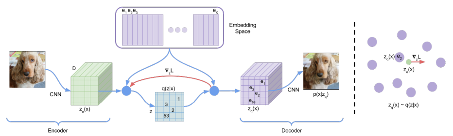
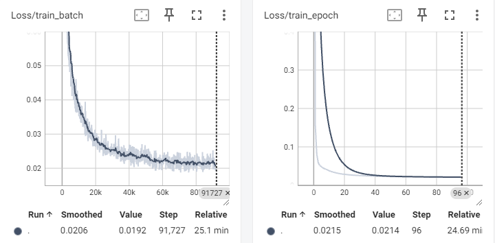
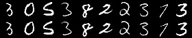

# VQVAE_from_scratch

## Introduction

Pytorch版本实现的VQVAE(仅供学习)

## Preliminary

- **VQVAE-architecture**

## Loss

## Inference

## Acknowledgements

- [轻松理解 VQ-VAE：首个提出 codebook 机制的生成模型](https://zhouyifan.net/2023/06/06/20230527-VQVAE/)
- [VQVAE预训练模型的论文原理及PyTorch代码逐行讲解](https://www.bilibili.com/video/BV14Y4y1X7wb/?spm_id_from=333.337.search-card.all.click)
- [Neural Discrete Representation Learning](https://arxiv.org/pdf/1711.00937)
